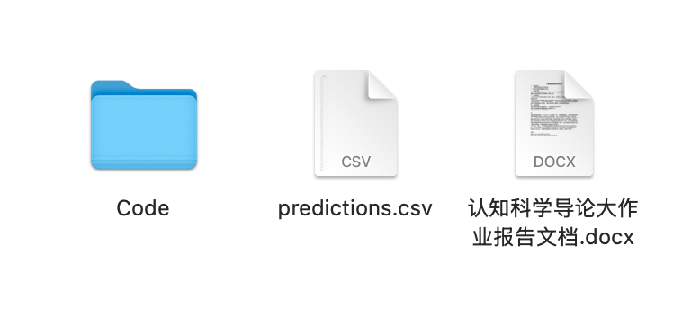

# 认知科学导论大作业说明文档

## 一、作业目标

本次大作业要求同学基于给定的脑电数据，完成一个二分类模型的设计与实现。  
任务目标是根据 EEG 样本判断其类别，标签为：

- `background`
- `target`

将提供训练集数据及其标签，同时提供测试集数据。测试集标签不公开。  
同学需要使用训练集完成模型训练，并对测试集生成预测结果。

## 二、文件结构

学生版工程目录结构如下：

```text
学生版/
├── data/
│   ├── train/
│   ├── test/
│   └── train_labels.csv
├── models/
├── res/
│   └── sample_predictions.csv
├── load_data.py
├── model.py
├── train.py
├── test.py
├── utils.py
└── 认知科学导论大作业说明文档.md
```

各部分含义如下：

- `data/train/`：训练集 EEG 数据
- `data/test/`：测试集 EEG 数据
- `data/train_labels.csv`：训练集标签文件
- `models/`：保存训练得到的模型参数
- `res/`：保存测试集预测结果
- `load_data.py`：数据读取脚本
- `model.py`：模型定义脚本
- `train.py`：训练脚本
- `test.py`：测试与生成提交结果脚本

## 三、数据说明

每个 EEG 样本保存为一个 `.npy` 文件。  
样本维度可理解为：

- `1`：单个样本的输入通道维
- `59`：脑电通道数
- `282`：时间点数

训练标签文件 `train_labels.csv` 至少包含如下字段：

- `eeg_file`
- `label`

其中：

- `eeg_file` 为对应 EEG 文件名
- `label` 为样本类别

## 四、给定代码说明

本项目已提供了一个最基本的代码骨架，但并未提供高性能模型。

- `model.py` 中仅给出一个简单的示例模型
- 同学可以使用`PyTorch`框架自行修改模型结构
- 也可以尝试一些传统机器学习方法

鼓励同学从以下角度进行改进：

- 模型结构设计
- 训练策略优化
- 验证集划分方法
- 正则化与防止过拟合
- 类别不平衡处理

## 五、运行方式

训练模型：

```python
python train.py
```

测试并生成预测文件：

```python
python test.py
```

运行 `test.py` 后，需要在 `res/` 下生成：

- `predictions.csv`

格式示例见：

- `res/sample_predictions.csv`

提交结果建议至少包含两列：

- `eeg_file`
- `prediction`

## 六、提交内容

每组需要提交以下内容：

- 完整代码
- 训练好的主要模型文件或可复现实验的说明
- 测试集预测结果 `predictions.csv`
- 大作业报告
- 讲解视频（5分钟内）
- 上述四个文件放在同一级目录下，如下图所示：
- 
- 将所有内容`{学生1学号}_{姓名}_{学生2学号}_{姓名}_{学生3学号}_{姓名}.zip`为名进行压缩。

## 七、报告内容

报告至少需包含以下部分：

1. 任务理解与问题定义
2. 数据特点分析
3. 模型设计与改进思路（需要提供模型的结构图）
4. 训练方法与验证方案
5. 实验结果与误差分析
6. 小组成员分工
7. 若采用了别人的模型需附上参考文献

## 八、评分

从以下几个方面综合评分：

- 模型效果
- 实验过程是否完整
- 报告表达是否清晰
- 结果分析是否深入

其中，模型效果部分参考如下准确率评分公式：

$$
\min\left(100,\max\left(60,\ 60 + 40 \times \left(\frac{acc-0.50}{topline-0.50}\right)^{\log(2.2)}\right)\right)
$$

其中：topline取0.75

- `acc` 表示学生提交结果在测试集上的准确率
- `0.50` 为基准准确率，低于或等于该值时准确率部分按 `60` 分计

也就是说：

- 当 `acc <= 0.50` 时，准确率部分记为 `60` 分
- 当 `acc` 接近 `topline` 时，准确率部分逐步接近 `100` 分
- 当 `acc >= topline` 时，准确率部分按 `100` 分计

## 九、说明

本工程中的 `model.py` 只是一个起点，不代表推荐的最终方案。  
同学需要基于深度学习机器学习课程所学，完成自己的模型设计与实验过程。
